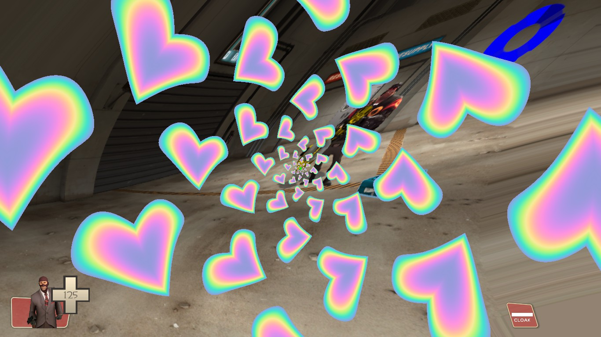

# sdk_screenspace_shaders
SDK that allows you to easily create custom screenspace pixel shaders for Source games.

# Background
It has been discovered that the Source engine supports loading custom pixel shaders, via a completely undocumented shader named `screenspace_general`.
The pixel shaders so far have been proven to work on the following:
- Screen overlays
- Brushes
- Models
- info_overlay
- Decals
- Particles

Such custom shaders can be packed into maps or downloaded by servers, and it works on both Windows and Linux.

This has only been extensively tested on Team Fortress 2 and Counter-Strike: Source, but it should also work for Day of Defeat Source, Half Life 2 etc.

Left 4 Dead 2 and Portal 2 have an extended version of this shader which also supports setting a custom vertex shader. Setting up a custom vertex shader has not been researched yet. 

To allow the shader to work on anything that isn't a screen overlay, the `$x360appchooser 1` variable must be set (enables vertex transformations).
Unfortunately, in L4D2 and Portal 2 this variable does not exist, therefore vertices are not transformed by the view projection matrix.
This could be workarounded by defining a custom vertex shader.

# Usage
This repository contains everything required to compile shaders, you do not need to download anything else.

Go into the `shadersrc` folder and run `build_shaders.bat`. This should build the template and example shaders successfully.
The generated shaders are in the `shaders` folder. You can drag and drop a shader onto the `build_shader.bat` to only compile a specific shader.

Create a new folder in your game's `custom` folder such as `my_shaders`.
Copy the `shaders` folder to that new folder, then copy the `materials` folder from this repository to your new folder as well.

Test if the shaders work by loading any map and running this command in console: 
`sv_cheats 1;r_screenoverlay effects/shaders/example_wave`. 
You should see your screen get deformed in a wavy-like pattern.

## Creating a Shader
To create a new shader, copy the `template_ps2x.hlsl` file and rename it to whatever you like.  This example will rename it to `coolshader_ps2x.hlsl` (note: do not change the `_ps2x` suffix).

Add this new shader to the list in `compile_shader_list.txt`.
After you run `build_shaders.bat` again, your new shader should now get compiled.

Next up, you will need to copy the auto-generated VMT for your shader. Go into `materials/effects/shaders/` and copy the vmt file (e.g. `coolshader.vmt`).  You can put this file in your custom `my_shaders` folder using the same `materials/effects/shaders` file structure, or the regular game directory.

### VSCode
If you are using VSCode, this repo includes a launch.json and a tasks.json to build the shaders using VSCode's build/debug commands.

Clone this repository and open the main `sdk_screenspace_shaders` folder in VSCode by going to File > Open Folder.  Alternatively you can press Ctrl + K + O or Ctrl + M + O.

You can now press either Ctrl + Shift + D and select "Build Current Shader".  Alternatively, press Ctrl + Shift + B to either build the current shader or all shaders (same as `build_shaders.bat`).

## Applying the Shader
Your new shader is now setup, and you can overlay it on players using two methods:

- `SetScriptOverlayMaterial` (only in TF2 and HL2DM): Fire the `SetScriptOverlayMaterial` input on the !activator with `effects/shaders/coolshader` parameter (or use the equivalent VScript function).
- `r_screenoverlay` : Use a [point_clientcommand](https://developer.valvesoftware.com/wiki/point_clientcommand) and fire the `Command` input with `r_screenoverlay effects/shaders/coolshader` as the parameter on the !activator.

Note: in TF2 and HL2DM, you can stack shaders across two overlays together using both `SetScriptOverlayMaterial` and `r_screenoverlay`.

On brushes/info_overlay/decals, change the $basetexture (or whatever texture you are sampling) to your desired brush texture.

On models, do the same thing as brushes, but also add `$softwareskin 1` and `$translucent 1` to the vmt. Both are required for the shader to work correctly. In the .qc, add `$mostlyopaque` as well.

## Modifying the Shader
If you are new to shaders, they are written in a language named HLSL. You can find plenty of guides about this online. This repository comes with multiple example shaders that you can reference. 

The basic overview is that the shader code is run for *every* pixel on the screen. Each shader receives a texture coordinate representing where this pixel is, and it must return the new RGBA color value of the pixel at this position.

[Shadertoy](https://www.shadertoy.com/) is a good website to look for inspiration or see how things are done. Note that these are written in GLSL, a similar language to HLSL with some differences (see below).

The screenspace pixel shader provided by the engine comes with support for up to 4 textures and 16 customizable float constants. The textures and constants can be modified dynamically in the VMT (see template.vmt), especially with material proxies.

### Porting GLSL to HLSL

Shaders written in GLSL can be ported to HLSL with some changes as follows. This is not a comprehensive list, there may be more changes required.

* Different main function form (copy it from the examples)
* `vec2`, `vec3`, `vec4` -> `float2`, `float3`, `float4`
* `mat2`, `mat3`, `mat4` -> `float2x2`, `float3x3`, `float4x4`
* `texture` -> `tex2D`
* `atan` -> `atan2`
* `fract` -> `frac`
* `mix` -> `lerp`
* `fma` -> `mad`
* Constructors need all arguments e.g. `vec3(1.0)` -> `float(1.0, 1.0, 1.0)`
* Origin in GLSL is bottom left. In HLSL it's top left. (UV y coordinate is flipped)
* Shadertoy passes texture coordinates (`fragCoord`) in pixel form (0-width, 0-height). Source passes `baseTextureCoord` in normalized form (0-1, 0-1). The texture dimensions can be recovered using `TexBaseSize` etc.
* GLSL is matrix column-major while HLSL is row-major. Matrices need to be re-ordered (i.e. transposed)

## Reloading the Shader
Unfortunately, the shaders cannot be directly reloaded in-game without restarting the game itself. 

But there is a workaround: you can rename a recompiled shader to something else, change the $pixshader in the VMT to this new name, then type `mat_reloadmaterial <vmt name>` to reload it.

## Packing the Shader
If using these in a map: you will need to manually include the shader files if packing with VIDE or CompilePal, as they will not autodetect the files.

# Limitations
* Custom pixel shaders do not work on DirectX 8. The screen will simply render like normal.
* Source is old and the shaders do not support everything that modern pixel shaders can offer, as the only shader model supported is 2.0b. For example, repeating for-loops don't exist, instead the compiler expands the instructions (which can lead to the instruction limit being hit quickly for large or complex loops).
* Native lightmap is not available if applying these to brush textures (it shouldbe be possible to sample a 2nd texture as the lightmap to workaround this)
* Texture dimension constants are not available in Left 4 Dead 2 and Portal 2 (no workaround known yet)

# Credits
This repository uses a jerryrigged shader setup from [Source SDK 2013](https://github.com/ValveSoftware/source-sdk-2013) and the [standalone shader compiler](https://github.com/SCell555/ShaderCompile) by SCell555. 
Some examples are adapted from [Shadertoy](https://www.shadertoy.com/).